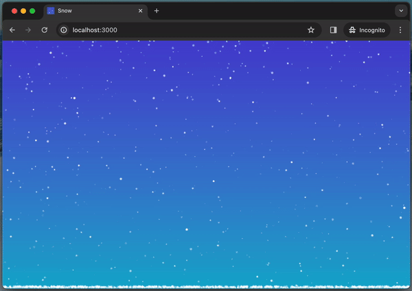

# snow ❄️

A simple JS script for simulating 2D snow using the Canvas API.



**Demo:** [https://demo.demo](https://demo.demo)

## Usage

Simply add the script to your HTML:

```html
<script src="scripts/snow.min.js"></script>
```

Then you can use the global `Snow` object in your code:

```javascript
Snow.attachToElement(el, {
  width: el.clientWidth,
  height: el.clientHeight,
});
```

For more configuration options check [snow.js](scripts/snow.js) config.
